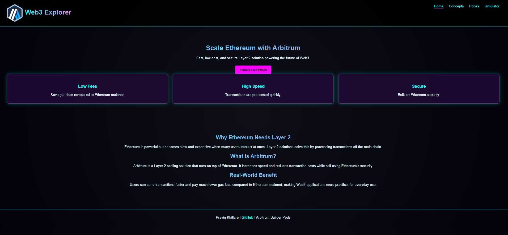
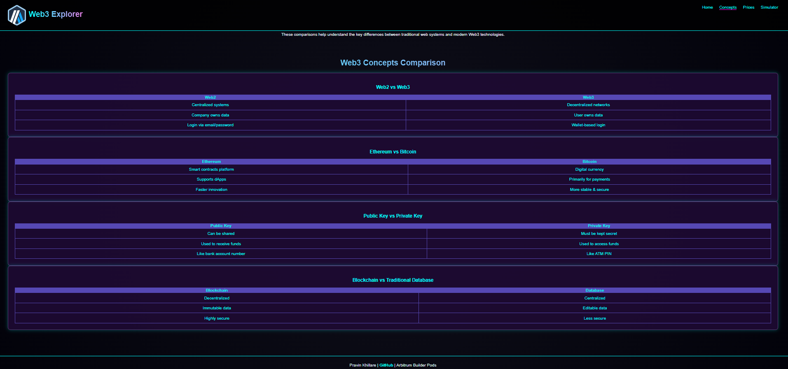
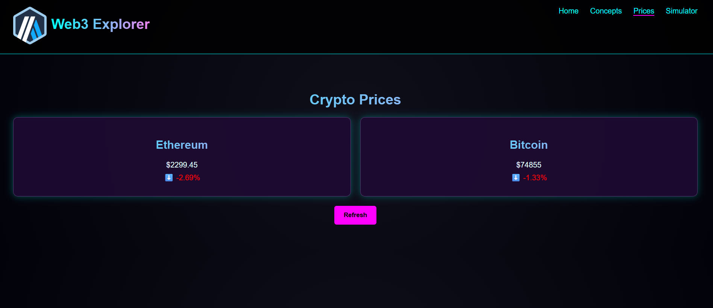
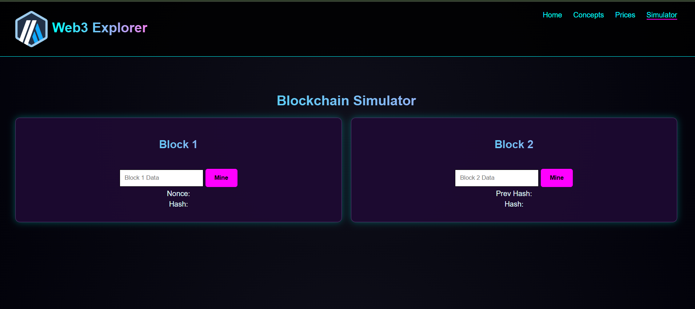

# Arbitrum-Lab

# 🚀 Web3 Explorer – Arbitrum Lab

A modern **Web3 educational website** designed to explore **Arbitrum (Layer 2 scaling solution)** with a clean cyberpunk UI.

This project helps users understand Ethereum scaling, view crypto prices, and interact with a simple simulator.

---

## 🌐 Features

### 🏠 Home Page
- Introduction to Arbitrum
- Benefits of Layer 2 scaling
- Clean and modern UI

### 📘 Concepts Page
- Beginner-friendly explanation of:
  - Web3
  - Ethereum
  - Layer 2 solutions

### 💰 Prices Page
- Displays cryptocurrency prices
- Dynamic updates using JavaScript

### 🧮 Simulator Page
- Interactive calculations
- Helps understand transactions and fees

---

## 🎨 UI Design

- Cyberpunk theme 🌌  
- Neon colors (cyan, violet, pink)  
- Glow effects & gradients  
- Responsive layout using flexbox  

---

## ⚙️ Technologies Used

- HTML5  
- CSS3  
- JavaScript  

## 📸 Screenshots

### 🏠 Home Page

### Concepts Page

### 💰 Prices Page

### 🧮 Simulator Page
